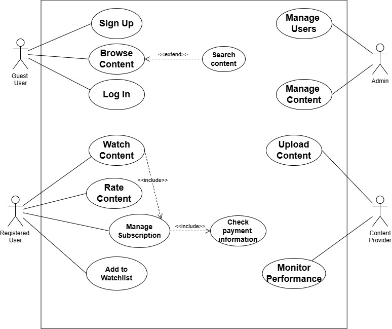
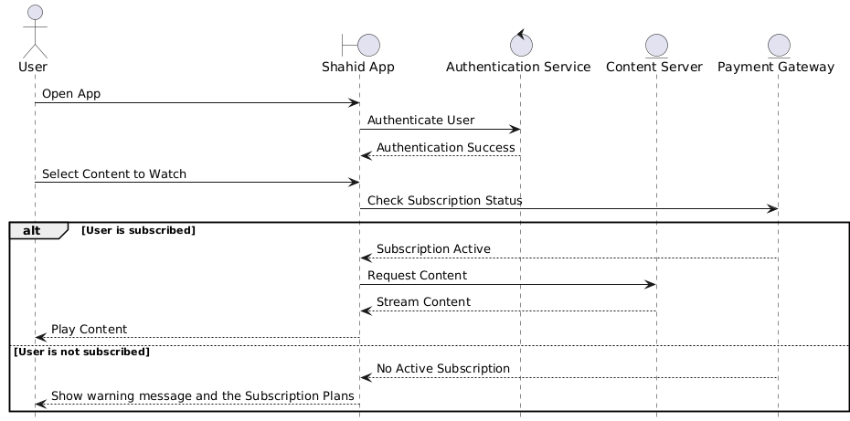

# Shahid App 🎬

Shahid App is a Windows Forms-based media streaming platform developed using the .NET Framework. It offers users the ability to browse, watch, and manage digital content like movies, series, and live TV. The app integrates with a database and utilizes Crystal Reports for advanced reporting features.

## 🧰 Tech Stack

- C# (.NET Framework)
- Windows Forms (WinForms)
- Crystal Reports
- Microsoft SQL Server
- Visual Studio

## ✨ Key Features

- **User Authentication**: Secure sign-up, login, and logout functionality
- **Content Browsing**: Categorized listing of media (movies, series, live TV)
- **Search Functionality**: Keyword-based content search
- **Video Streaming & Rating**: Users can stream content and leave ratings
- **Subscription Management**: Subscribe to or cancel premium access
- **Watchlist**: Save content for later viewing
- **Reports**: Generate user and system reports via Crystal Reports

## 🧑‍💼 Functional Requirements Summary

| Feature                | Description                                               |
|------------------------|-----------------------------------------------------------|
| User Authentication    | Secure login/logout and account creation                  |
| Content Browsing       | Browse and filter media content                           |
| Search                 | Search by title, genre, or keywords                        |
| Watch & Rate           | Play video content and allow user rating                  |
| Subscription System    | Manage plan subscriptions including cancellation          |
| Watchlist              | Add/remove items to personal watchlist                    |
| Reporting              | Generate structured reports using Crystal Reports         |

## 🛠️ Non-Functional Requirements

- High performance (2-second startup for video)
- Secure data handling (encrypted user credentials)
- Scalable to support 10,000+ concurrent users
- High reliability (99.9% server uptime)
- User-friendly design

## 📊 Diagrams

### Use Case Diagram

### Sequence Diagram

